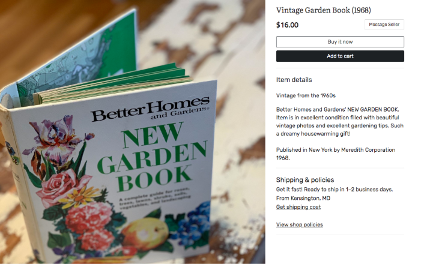
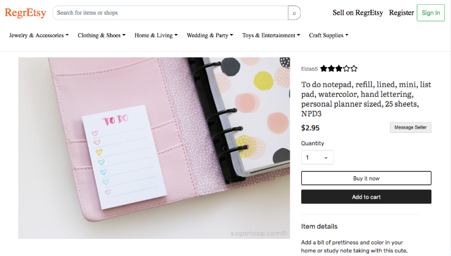

# Mock Etsy Item Details Microservice

> Implemented and styled an item details component for an Etsy clone. Packaged with other microservices using a reverse proxy server to approximate a functional Etsy item listing page.

## Related Projects

- https://github.com/mock-etsy/item-details
- https://github.com/mock-etsy/header-and-search
- https://github.com/mock-etsy/cnebs-reviews

## Tech Stack

- React
- JavaScript
- Node.js
- Express
- Axios
- MySQL
- knex.js
- Babel
- Webpack
- React-Bootstrap
- Broadcast Channel API
- Docker
- AWS (Elastic Beanstalk & RDS)
- Etsy API

## Workflow
Our team of four engineers followed Agile workflow methodology. We participated in daily standups and created [Trello tickets](https://trello.com/b/uxhI4yLW/mock-etsy) for implementation and investigation tasks, bug fixes, tech debt/refactoring, and user stories. We required pull request reviews and conducted code reviews.

## Optimizations
I optimized my component's page load speed by using text compression middleware and switching webpack to production mode to decrease my bundle size, increasing my web score on Google PageSpeed to 99 and 83 on mobile.

I refactored to use knex.js to sanitize database queries and decrease security vulnerabilities.

## Stitching together the microservices

Our team's microservices communicated via Broadcast Channel API and were stitched together with a [reverse proxy server](https://github.com/mock-etsy/brooke-proxy).

## Usage

> Some usage instructions:
1. npm install
2. Start server with following: npm run server-dev
3. Navigate to site by going to localhost:3001 (port subject to change)

### Installing Dependencies

From within the root directory:

> npm install

